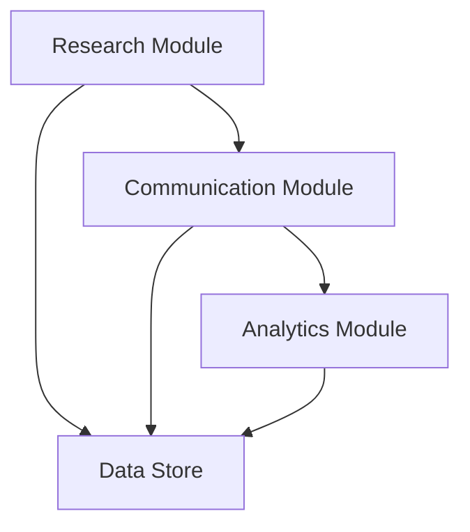

# System Patterns

## Architecture Overview
The marketing solution follows a modular architecture with these key components:

### 1. Research Module
- Uses APIs (Google Places, Yelp, etc.) for business discovery
- Web scraping component for additional data gathering
- Data normalization and validation layer
- Local storage for business information

### 2. Communication Module
- Gmail API integration
  - Email template system
  - Rate limiting handler
  - Delivery status tracking
- Twitter API integration
  - Tweet composition
  - Direct message management
  - Engagement tracking

### 3. Analytics Module
- Campaign performance tracking
- Response rate analysis
- A/B testing framework
- Reporting system

## Design Patterns
1. Repository Pattern
   - Abstraction for data storage
   - Consistent interface for different data sources

2. Strategy Pattern
   - Flexible algorithm implementation for different:
     - Research methods
     - Contact approaches
     - Analytics calculations

3. Observer Pattern
   - Event-driven updates for:
     - Campaign status changes
     - Response notifications
     - Compliance alerts

4. Factory Pattern
   - Creation of different types of:
     - Research queries
     - Contact messages
     - Analytics reports

## Component Relationships

## Technical Decisions
1. API First Approach
   - RESTful endpoints for all major functions
   - Clear separation of concerns
   - Easy integration with future tools

2. Asynchronous Processing
   - Queue-based job processing
   - Retry mechanisms
   - Error handling

3. Data Management
   - Local caching
   - Incremental updates
   - Data validation pipeline

4. Security
   - API key management
   - Rate limiting
   - Data encryption
   - Access control
