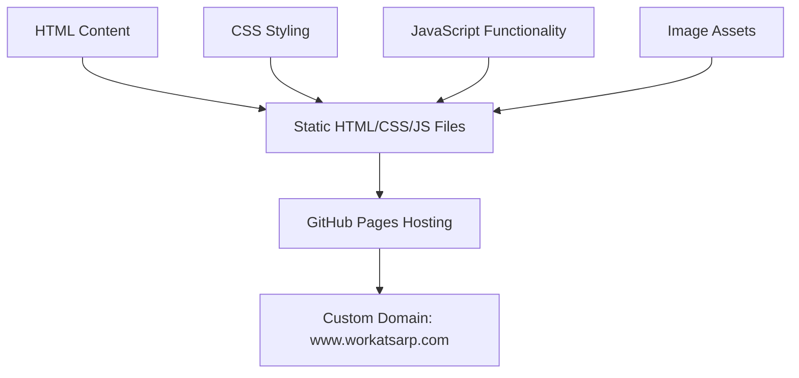
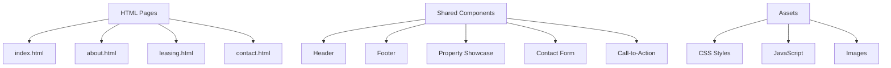
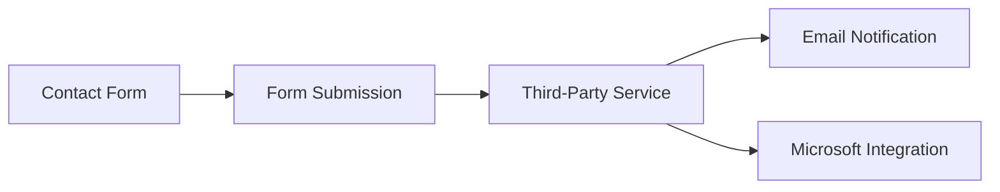
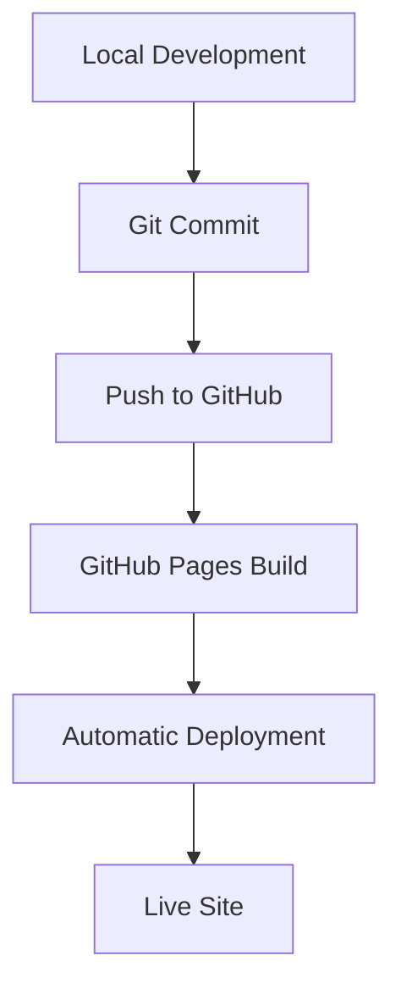

# System Patterns: www.workatsarp.com

## Architecture Overview
The www.workatsarp.com website is built as a static site using HTML, CSS, and JavaScript, and is designed to be hosted on GitHub Pages. This architecture provides a secure, fast, and cost-effective solution for a marketing-focused website.

## Core Design Patterns

### Component-Based Structure
The site follows a component-based design pattern, with reusable elements across HTML pages:

### Content Management
Content is managed through structured HTML files, allowing for easy updates and maintenance:

1. **HTML Structure**: Semantic HTML5 elements for clear content organization
2. **CSS Variables**: Custom properties for consistent styling and easy updates
3. **Modular JavaScript**: Organized functionality for specific components

### Responsive Design Pattern
The site implements a mobile-first responsive design approach:

1. **Base Styles**: Core styling for mobile devices
2. **Media Queries**: Breakpoints for tablet and desktop views
3. **Fluid Grids**: Percentage-based layouts for flexible content
4. **Flexible Images**: Images that scale with their containers

## Technical Components

### Front-End Framework
The site uses a lightweight CSS framework aligned with ZG Companies branding:

1. **Grid System**: For layout structure
2. **Typography**: Consistent text styling
3. **UI Components**: Buttons, forms, cards, etc.
4. **Utilities**: Helper classes for spacing, alignment, etc.

### JavaScript Functionality
Minimal JavaScript is used for enhanced functionality:

1. **Image Gallery**: For property showcase
2. **Form Validation**: For contact/inquiry forms
3. **Interactive Maps**: For location information
4. **Smooth Scrolling**: For improved navigation

### SEO Implementation
SEO best practices are implemented throughout:

1. **Meta Tags**: Title, description, and Open Graph tags
2. **Structured Data**: JSON-LD for local business information
3. **Semantic HTML**: Proper use of HTML5 elements
4. **Sitemap**: XML sitemap for search engines
5. **Canonical URLs**: To prevent duplicate content issues

## Integration Points

### Form Handling
Since GitHub Pages doesn't support server-side processing, forms are handled through a third-party service:

### External Services
The site integrates with external services for enhanced functionality:

1. **Maps**: Embedded map service for location information
2. **Analytics**: For tracking visitor behavior
3. **Form Processing**: For handling contact form submissions

## Deployment Pattern
The site follows a GitHub Pages deployment workflow:

## Maintenance Considerations
1. **Content Updates**: Managed through direct HTML edits via GitHub's interface
2. **Design Changes**: Implemented through CSS modifications in the styles.css file
3. **Feature Additions**: Added through custom JavaScript in the main.js file
4. **Performance Monitoring**: Regular checks for page speed and optimization
5. **Image Updates**: Replace placeholder images with actual property photos when available
